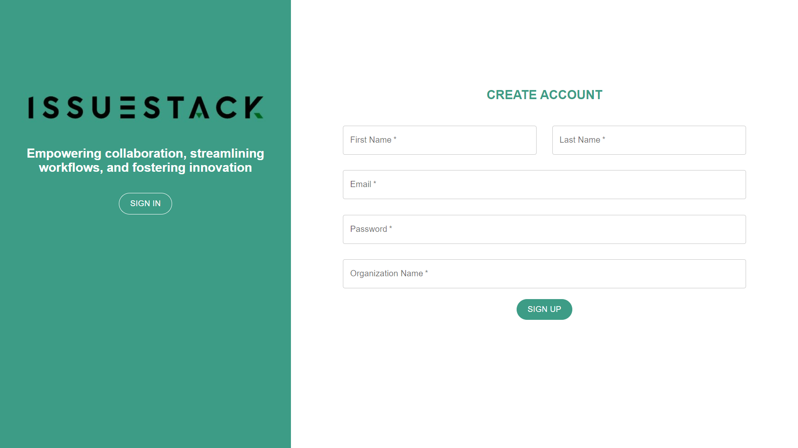
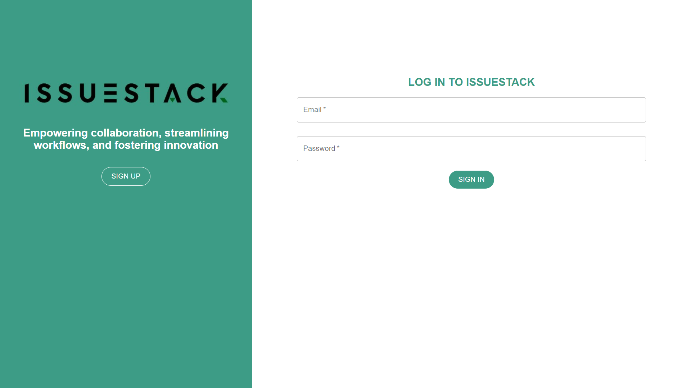

# Authentication Using MERN STACK [(Live App Link)](https://bkassignment1.netlify.app/)

### Hightlights (Screenshorts Attached ⬇️)
- > Authentication using MERN stack 
- > APP uses modern React and NodeJS features like ES Moduels, Async Await, Destructuring, Hooks, Context API, and Immutable Data Structures. 

## 🚀 Tech and Tools Used - MERN ⚒️🔥🔍

- React.JS 
- Redux
- NodeJS
- Express
- MongoDB
- VS Code
- Render
- REST APIS

## ⚙️ Features 🚀

- User Authentication by Email

## 📸 Screenshots

## SignUp Page

## SignIn Page

#
## Author : Bhautik Koshiya [(Github Profile)](https://github.com/BhautikKoshiya)

## Contact

If you have any questions, feel free to contact us. We appreciate your feedback!

## Acknowledgements

We would like to thank the open source community for their continuous support and inspiration. We are always learning and improving, thanks to you.